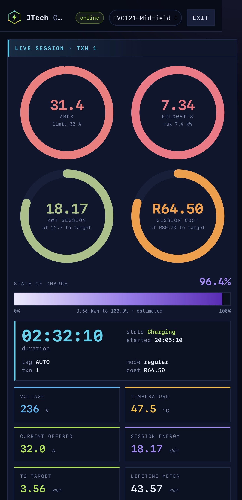
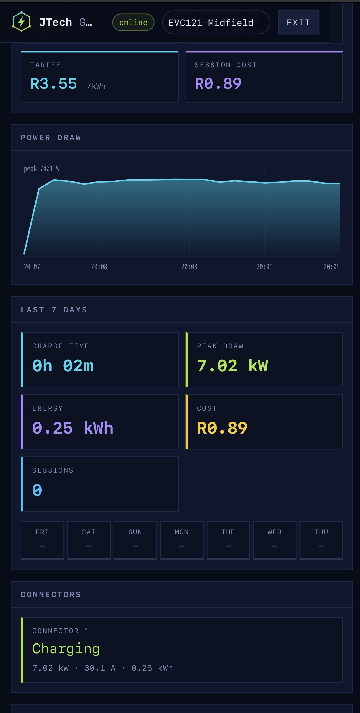
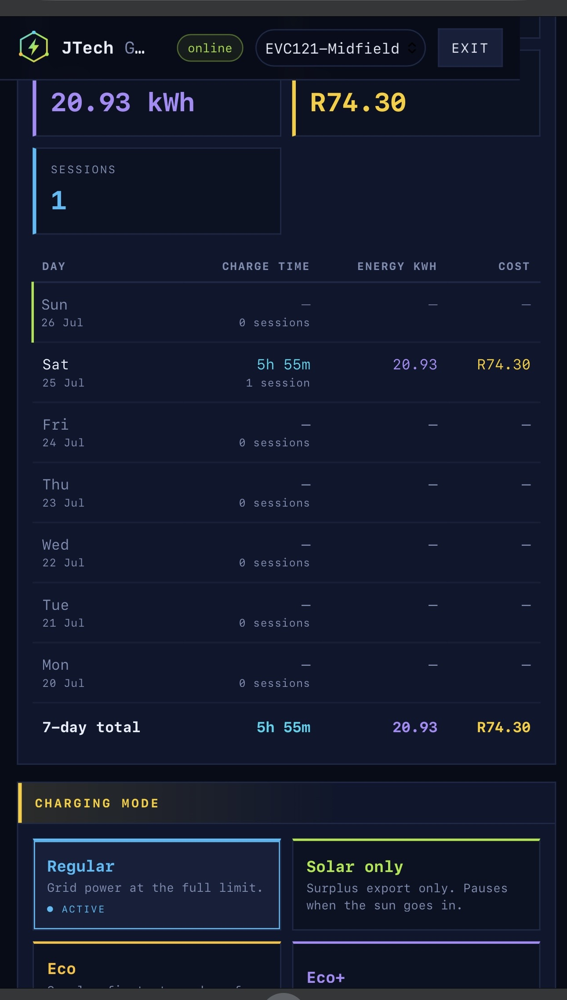

# JTech Grid Control

A self-hosted OCPP 1.6J central system and dashboard for the **Teltonika
TeltoCharge EVC** EV charger. Run it on a NAS, a Raspberry Pi, or any machine
with Docker, and control your charger from a browser or phone — on your own
network, or remotely. You can create a port forward on port 8081 and access this anywhere,
alternatively you can just use a VPN for added security

```
TeltoCharge EVC  ──ws://host:9000/EVC121──▶  central_system.py  ◀──https://host:8080── (FW)  my link evcontrol.mylink.whatever:8081
```

  


## What it does

- **Live dashboard** — amps, power, session energy, cost, and a derived state of
  charge, updating in real time while you charge.
- **Charging schedule** — a daily window that caps current outside it, so you
  charge on off-peak tariffs.
- **Auto-start** — begins a session when you plug in, or only inside the
  schedule window, since OCPP alone can't start a charge on a timer.
- **Charging modes** — Regular, Solar-only, Eco and Eco+ via the Teltonika
  vendor keys (firmware 1.12+).
- **Usage history** — every session stored permanently, with per-month energy
  and cost graphs and a session list, modelled on the Teltonika app's own
  usage screens.
- **Accurate sessions** — a session closes at the real end of charging (cable
  out, target SOC reached, schedule window closed, or cycle finished), dated by
  when it started.
- **Cost tracking** — set your tariff; each session records the price in force
  at the time, so changing it later doesn't rewrite history.
- **HTTPS, auth, and a security-audited surface** — sign-in, a self-signed
  certificate generated on first start, strict CSP, and no SQL anywhere.
- **iPhone home-screen app** — installable as a PWA; add to home screen from
  Safari.

  I created this purely out of frustration as the premium Teltonika Teltocharge series of EV chargers does not allow any remote control except for bluetooth, well it supports OCPP 1.6, then JTech Grid Control was born!

## Requirements

- A TeltoCharge EVC Series charger (other OCPP 1.6J chargers may work but are untested).
- This is a fully OCCP 1.6 compliant webapp, so other OCPP chargers should work. 
- Docker, or Docker + Container Manager on a Synology NAS.
- The charger and the host on the same LAN.

## Quick start

```bash
git clone https://github.com/YOUR_USERNAME/jtech-grid-control.git
cd jtech-grid-control
docker compose up -d --build
```

Then:

1. Open `https://YOUR_HOST:8081/` and accept the certificate warning.
2. Sign in. If you didn't set `OCPP_ADMIN_PASSWORD`, a password is printed to the
   container log on first start: `docker compose logs | grep pass`.
3. In the Teltonika app, point the charger's OCPP URL at
   `ws://YOUR_HOST:9081/` (the trailing slash matters) and set the charge point
   ID.
4. Edit `data/config.env` (created on first start) to set your hostname, tariff,
   and charger ID, then restart.

No hardware yet? Run the simulator: `python simulator.py --id EVC121 --plugged`.

## Configuration

All settings live in `data/config.env`, a plain file created on first start.
See `env.example` for the full list with comments. Nothing sensitive ships in
the image; passwords and certificates stay on your host.

## Documentation

| Guide | For |
|---|---|
| `INSTALL.md` | First install on Synology, and the common traps |
| `UPGRADE.md` | Upgrading without losing history |
| `PUBLIC-ACCESS.md` | Reaching it over the internet, safely |
| `SECURITY.md` | The security model and audit findings |
| `IPHONE.md` | Home-screen install and native-app options |

## Compatibility

Built and tested against the TeltoCharge EVC121 (tethered, single-phase, 32 A).
The OCPP 1.6J implementation is standard, so other chargers may work, but the
charging modes and some defaults are Teltonika-specific. Reports of other
hardware welcome.

## Contributing

Issues and pull requests are welcome. Before opening a PR that touches the
dashboard, run `python check.py` — it catches the CSP and markup mistakes that a
browser hides.

## License

MIT — see `LICENSE`.

---

# Reference

OCPP 1.6J central system for the Teltonika TeltoCharge EVC121.

A self-hosted central system (CSMS): the charger dials in over WebSocket, and you
drive it from a REST API or the browser dashboard.

```
TeltoCharge EVC121  ──ws://host:9000/EVC121──▶  central_system.py  ◀──http://host:8080──  you
```

## Files

| File | What it is |
|---|---|
| `central_system.py` | The server: OCPP WebSocket endpoint + REST API + dashboard |
| `static/index.html` | Operator dashboard (no build step, plain HTML/JS) |
| `simulator.py` | A fake charge point so you can test without hardware |
| `requirements.txt` | Pinned dependencies |
| `Dockerfile`, `docker-compose.yml` | Container build |
| `static/login.html` | Sign-in page |
| `static/favicon.svg` | Browser icon |
| `INSTALL.md` | First install, and the traps |
| `UPGRADE.md` | Upgrading without losing history |
| `env.example` | Copy to `.env` and edit — upgrades never overwrite it |
| `SECURITY.md` | Audit findings and internet-exposure checklist |
| `IPHONE.md` | Home screen install, and the native app options |
| `PUBLIC-ACCESS.md` | Trusted certificates and safe internet exposure |
| `SYNOLOGY.md` | Synology-specific detail |
| `verify.sh` | Post-install check |
| `check.py` | Static check of the pages — run after editing them |
| `healthcheck.py` | Container healthcheck (HTTP/HTTPS aware) |
| `VERSION` | Build number and tested dependency versions |

## Run it

With Docker:

```bash
docker compose up -d --build     # dashboard on :8081, OCPP on :9000
```

See `SYNOLOGY.md` for Container Manager on a NAS.

Directly:

```bash
python -m venv .venv && source .venv/bin/activate
pip install -r requirements.txt
python central_system.py                 # --host / --ocpp-port / --api-port to override
```

- OCPP endpoint: `ws://<host>:9000/<ChargePointId>`
- Dashboard: `http://<host>:8080/`
- Sign in at `http://<host>:8080/login`

Set `OCPP_ADMIN_USER` and `OCPP_ADMIN_PASSWORD`. If you don't, a random password
is generated at startup and printed to the log — check it with
`docker logs ocpp-cs | head -20`.

Test without the charger, in a second terminal:

```bash
python simulator.py --url ws://localhost:9000 --id SIM001
```

## Point the EVC121 at it

Configuration happens in the Teltonika app over Bluetooth, not over the network:

1. Get the charger onto the same network as the server — Ethernet, Wi-Fi, or its
   SIM slot. Ethernet is DHCP by default; turn DHCP off if you want a static address.
2. In the Teltonika app, open the OCPP settings, enter the server URL and a charge
   point identity, enable OCPP, and save. The app shows whether the connection
   succeeded.
   - URL: `ws://<server-ip>:9000/` — Teltonika requires the URL to end with `/`.
     The server tolerates the `//EVC121` path that produces.
   - Charge point ID: usually the charger's serial number. It becomes the path
     segment and the ID in the dashboard.
3. Watch the server log. You should see `Connected`, then `BootNotification`,
   then a `StatusNotification` of `Available`.

Things to know about this charger:

- When OCPP is enabled, the charger's own scheduled charging and randomized-delay
  features stop applying. The backend is in charge.
- **Defaults are unhelpfully slow.** `HeartbeatInterval` and
  `MeterValueSampleInterval` both default to 3600, and `MeterValuesSampledData`
  defaults to the energy register only. Set them on first connection or the
  dashboard will look dead. Minimum meter interval is 5s.
- **`AuthorizeRemoteTxRequests` defaults to 1**, so a remote start triggers an
  `Authorize` first. This server accepts any tag by default
  (`ACCEPT_UNKNOWN_TAGS = True`), so it works either way — but set the key to 0 if
  you want to skip the round-trip.
- **This unit is tethered**, so `UnlockConnector` is not applicable — the charger
  answers `NotSupported`. The button is removed from the dashboard; the API route
  is still there if you ever swap to a socket model. `NumberOfConnectors` is 1 and
  read-only, so connector 1 is the only valid target.
- Supported measurands: `Energy.Active.Import.Register`, `Current.Import`,
  `Current.Offered`, `Voltage`, `Temperature`, `Power.Active.Import`. The dashboard
  shows whichever arrive and falls back to current × voltage if power is absent.
- Vendor keys beyond the documented set (solar charging, for example) vary by
  firmware — run "Read all keys" against your unit to see what yours exposes.

## What you can do

| Dashboard button | OCPP message |
|---|---|
| Start charging | `RemoteStartTransaction` |
| Stop charging | `RemoteStopTransaction` |
| Apply limit / Clear limit | `SetChargingProfile` / `ClearChargingProfile` (TxDefaultProfile, amps) |
| Take offline / Bring online | `ChangeAvailability` |
| Regular / Solar only / Eco / Eco+ | `ChangeConfiguration` on `Solar` and `SolarCharging` |
| Apply / clear schedule | `SetChargingProfile` recurring daily / `ClearChargingProfile` |
| Apply recommended | 13 × `ChangeConfiguration` |
| Measurands seen | local diagnostic, no message sent |
| Download / Restore backup | local, exports and reloads history and settings |
| — (tethered unit, no unlock) | `UnlockConnector` — API only |
| Soft / Hard reset | `Reset` |
| Read all keys / Write key | `GetConfiguration` / `ChangeConfiguration` |

API-only (no button yet): `ClearCache`, `GetCompositeSchedule`, `ReserveNow`,
`CancelReservation`, `GetLocalListVersion`, `SendLocalList`, `GetDiagnostics`,
`UpdateFirmware`, `TriggerMessage`.

Inbound messages handled: `BootNotification`, `Heartbeat`, `StatusNotification`,
`Authorize`, `StartTransaction`, `StopTransaction`, `MeterValues`, `DataTransfer`,
`FirmwareStatusNotification`, `DiagnosticsStatusNotification`.

### Curl equivalents

```bash
curl localhost:8080/api/chargers
curl -X POST localhost:8080/api/chargers/EVC121/start  -H 'Content-Type: application/json' -d '{"connectorId":1,"idTag":"DEMO"}'
curl -X POST localhost:8080/api/chargers/EVC121/limit  -H 'Content-Type: application/json' -d '{"connectorId":1,"limitAmps":10,"numberPhases":3}'
curl "localhost:8080/api/chargers/EVC121/configuration"
curl -X POST localhost:8080/api/chargers/EVC121/configuration -H 'Content-Type: application/json' -d '{"key":"MeterValueSampleInterval","value":"30"}'
```

## Signing in

| Variable | Default | Notes |
|---|---|---|
| `OCPP_ADMIN_USER` | `admin` | |
| `OCPP_ADMIN_PASSWORD` | generated | Printed to the log if unset |
| `OCPP_COOKIE_SECURE` | `0` | Set to `1` behind HTTPS so the cookie never travels in the clear |

Sessions last 8 hours and live in memory — a restart signs you out. Sign-in is
rate-limited to 5 failures per IP per 5 minutes. Every API route and the
dashboard itself require a valid session; the only unauthenticated routes are
`/login` and the login endpoint.

## Charging modes

Teltonika added two vendor keys in firmware 1.12:

| Key | Values | Meaning |
|---|---|---|
| `Solar` | `0`, `1` | Solar charging feature on or off |
| `SolarCharging` | `regular`, `solar`, `eco`, `eco_plus` | Which profile is active |

The mode buttons write both: picking anything other than Regular sets `Solar=1`
first, then the profile. These are not part of the OCPP standard, so a charger on
older firmware returns them as unknown keys — the dashboard detects that and
disables the buttons rather than pretending.

Solar modes also need the feature commissioned with a supported energy meter.
Without one the charger has no import/export reading to work from.

## Set these on first connection

Values verified against Teltonika's published key table — anything outside the
accepted range comes back `Rejected`.

| Key | Set to | Charger default | Accepted range |
|---|---|---|---|
| `HeartbeatInterval` | `60` | 3600 | 60–86400 |
| `MeterValueSampleInterval` | `30` | 3600 | 5–84600 |
| `MeterValuesSampledData` | `Energy.Active.Import.Register,Power.Active.Import,Current.Import,Voltage,Temperature` | energy only | the six measurands above |
| `AuthorizeRemoteTxRequests` | `0` | 1 | 0, 1 |
| `ConnectionTimeOut` | `120` | 120 | 1–3600 |
| `WebSocketPingInterval` | `10` | 10 | 1–1200 |

Note the booleans are `0`/`1`, not `true`/`false`.

Smart-charging ceilings the server respects for you: rate unit must be Current
(amps, not watts), stack level max 5, max 5 schedule periods, max 9 profiles
installed.

## If you turn on the charger's security profile

`SecurityProfile` defaults to 0 (no auth). If you raise it to 1 or 2, the charger
sends HTTP Basic credentials — charge point ID as username, `AuthorizationKey`
(32–40 chars) as password. Give the server the same key and it will enforce it:

```bash
export OCPP_AUTHORIZATION_KEY="your-32-to-40-character-key"
python central_system.py
```

Profile 2 and 3 also require TLS, so you'd put `wss://` in front of it.

## Troubleshooting

- **Charger never appears.** The server requires the `ocpp1.6` subprotocol and
  closes anything else — check the log for that message. Then check firewalls on
  port 9000 and that the URL scheme is `ws://` not `http://`.
- **Remote start is accepted but nothing happens.** The car has to be plugged in
  and the connector in `Preparing` — on a tethered unit that means the cable is in
  the vehicle, not just hanging on the holster. If `AuthorizeRemoteTxRequests` is `true`, the
  idTag you send must pass `Authorize`.
- **Current limit ignored.** Check the charger's installer setting for maximum grid
  current — the profile can only lower the ceiling, not raise it. Some firmware
  also only honours `TxProfile` while a transaction is active; try purpose
  `TxProfile` if `TxDefaultProfile` doesn't stick.
- **Timeouts on commands.** The default `response_timeout` is 30s. A charger on a
  weak mobile signal may need longer.

## Before you put it anywhere real

This is a working control plane, not a production CSMS. What's missing:

- **Everything is in memory.** Restart the server and transaction history is gone.
  Add SQLite or Postgres for `transactions`, `EVENTS`, and the tag whitelist.
- **`ACCEPT_UNKNOWN_TAGS = True`** means any RFID card starts a charge. The
  dashboard is password-protected, but the charger's own tag reader is not.
- **Sessions live in memory**, so a restart signs everyone out. Fine for one
  operator; swap for signed tokens if you add more.
- **No TLS.** For anything off a trusted LAN, terminate `wss://` at nginx or
  Caddy and proxy to port 9000, and set the charger URL to `wss://`. Pair that
  with `SecurityProfile` 2 and the AuthorizationKey above.
- **No offline transaction replay.** The charger queues messages it couldn't
  deliver and sends them on reconnect with old timestamps — worth handling if you
  care about billing accuracy.


## Dashboard

Four live gauges — amps, kW, kWh this session, and solar kW — laid out 2×2 on a
phone and 4-across on a desktop. Each arc grades colour with load. Below them a
session timer, state, tag, transaction, mode and running cost; then voltage,
temperature, current offered, lifetime meter, tariff and session cost.

Polling runs at 1s while a session is active and 4s when idle. The real ceiling
is the charger: `MeterValueSampleInterval` has a 5s minimum, so nothing updates
faster than that regardless of polling.

### State of charge

Shown as a bar under the gauges rather than a ring: fill runs light violet to
deep violet as charge builds, with a lime marker at the target SOC from the
Control card. The caption reads out the kWh still needed to reach target.


The charger cannot read SOC. AC charging over the standard control pilot carries
no such signal — that needs ISO 15118, and Teltonika's measurand list does not
include `SoC`. So SOC is derived:

    soc = startSoc + (delivered kWh x efficiency) / batteryKwh x 100

You set battery capacity and the SOC at plug-in; efficiency defaults to 0.9 to
account for AC charging losses. If a charger ever does send an `SoC` measurand,
that is used instead and the caption says "from vehicle" rather than "estimated".

Set the SOC at plug-in each time you connect, or the gauge has no starting point.

### Gauges

Amps against the current limit, kW against the nominal ceiling, kWh delivered
this session against the energy needed to reach target SOC (40 kWh if no
starting SOC is set), and session cost against what it costs to get from the plug-in SOC to the target SOC
at the current tariff — so the ceiling tracks the actual battery state rather
than a fixed kWh figure. Colour grades sky blue through amber to rose.

Solar power is still tracked in the API (`session.solarW`, `session.solarSource`)
but is no longer a gauge: OCPP 1.6's measurand list is a fixed enum with no solar
entry, so a compliant charger cannot report it directly and the value was often
inferred rather than measured. `Power.Active.Export` is used when the charger
sends it.

### When a session is recorded

A session closes on whichever real end-of-charging event happens first, so the
recorded end is always the true end:

| Event | Charger signal | Reason logged |
|---|---|---|
| Cable pulled | StopTransaction | `EVDisconnected` |
| Car reaches target SOC | `SuspendedEV` | `SOCLimitReached` |
| Schedule window closes | watcher stop at boundary | `ScheduleWindowClosed` |
| Charge cycle finishes | `Finishing` / `Available` | `Local` |

The last row matters because some firmware ends a charge without a clean
StopTransaction; catching the status change stops a session hanging open.

Without this, a charge that finishes at 2am but stays plugged in until morning
would be logged as an all-night session. If the car resumes (surplus returns, or
the battery drops below target) the same session continues and is updated in
place rather than split in two. `SuspendedEVSE` — the charger pausing for a 0 A
schedule window, not the car finishing — is deliberately not a trigger. Disable
the whole behaviour with `OCPP_FINALISE_ON_SUSPENDED_EV=0`.

Sessions are dated by when they **start**. An overnight charge counts on the day
it began, not the day it ended.

### Usage

A month-at-a-time view with two per-day bar charts — power consumption in green,
money spent in cyan, each with a running total — over modelled on the Teltonika app: a totals bar (energy,
time, cost) over a list of that month's sessions, newest first, each showing
kWh, duration, timestamp and cost. The charts and list share one month
selection. The arrows step between months, back as far
as records exist. Sessions are kept effectively forever — the cap is 100,000,
raisable with `OCPP_HISTORY_MAX`.

Note: OCPP 1.6 has no command to read a charger's *past* transactions, so this
only contains sessions recorded while the server was running and persisting.
Sessions that happened before then live only in the charger and its own app.

### History and sessions

The history card defaults to the last 7 days but takes any range: 7-day, 30-day
and this-month buttons, plus two date fields for an arbitrary span up to a year.
Days as rows, newest first, with a total line.

Below it, an **All sessions** table lists every session ever recorded, 25 to a
page, newest first, with Newer/Older paging. Nothing rolls off — the 7-day view
just shows a window onto the same data.

### Last 7 days

Totals for charge time, peak draw, energy, cost and session count, then a table
with one row per day — newest first — showing charge time, energy and cost, with
a 7-day total row. Days with no charging show dashes rather than zeros. A session in progress is included in the
totals. Completed sessions are appended to `/app/data/sessions.json` at
`StopTransaction` with the tariff in force at that moment, so changing the price
later does not rewrite history. Last 2000 sessions are kept.

### Schedule and auto-start

These are two halves of one job, and the schedule alone is not enough.

A charging profile can only cap current inside a transaction that already
exists. Nothing in OCPP 1.6 opens a transaction on a timer — that needs an RFID
tap, a `RemoteStartTransaction`, or the charger's own free-vend mode. So a
schedule on its own leaves you pressing Start.

**Schedule** sends a daily recurring `TxDefaultProfile` allowing current inside
the window and 0 A outside it. Overnight windows are handled. Some firmware
rejects a 0 A period; the card reports the status if yours does.

**Auto-start** is the server watching for a connector in `Preparing` (or
suspended) with no transaction, and issuing `RemoteStartTransaction` itself.
Three settings:

| Mode | Behaviour |
|---|---|
| `off` | Nothing automatic. Press Start. |
| `plugged` | Starts as soon as the cable is in the car. |
| `schedule` | Starts only inside the window, and stops when it closes. |

Times are read from the container clock, so `TZ` in the compose file must be
right. The image installs `tzdata` — without it, `python:slim` ignores `TZ` and
runs on UTC, which shifts every window by the local offset. The dashboard shows
the timezone the server is actually using next to the schedule, and the startup
log warns if it fell back to UTC.

The watcher runs every 20 seconds and waits 2 minutes between attempts on the
same connector, so a charger refusing to start does not get hammered. Sessions
it opens are logged as `AutoStart` / `AutoStop` in the message log.

Use both together: auto-start opens the session, the profile enforces the
current cap.

Times are interpreted in the container's timezone, set by `TZ` in the compose
file.

### Tariff

Price per kWh is stored server-side, so it is the same on every device, and
persisted to `/app/data` when that volume is writable. Default R3.55, set via
`OCPP_PRICE_PER_KWH`.
